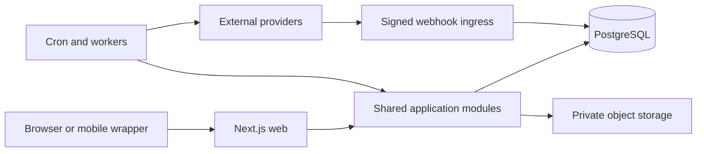

# Orqena domain map

## Decision

Orqena remains a modular Next.js monolith. The web process and separately scheduled workers share one versioned codebase, Prisma schema, authorization layer, configuration contract, and event envelopes. Extraction into services requires measured scaling or isolation evidence and a new ADR.

## Bounded contexts

| Context | Primary code | Owns | May depend on |
| --- | --- | --- | --- |
| Identity | `lib/auth`, auth routes | users, sessions, verification, platform accounts | tenants, platform |
| Tenants and access | `lib/tenant`, `lib/entity-context`, `lib/orqena` | companies, memberships, roles, scopes, approvals | identity, platform |
| CRM and work | app clients/works, `lib/business-profile` | clients, contacts, works, documents | tenants, sales, procurement |
| Sales | budget/invoice modules | budgets, invoices, payments | CRM/work, treasury, fiscal |
| Procurement | procurement actions | suppliers, purchase invoices, expenses | CRM/work, treasury |
| Treasury | `lib/economic-control` | accounts, movements, forecasts | sales, procurement |
| Fiscal | `lib/fiscal` (F2) | immutable fiscal ledger and transmissions | sales, platform |
| Privacy and security | `lib/privacy`, `lib/auth` | acceptances, requests, retention, incidents | identity, tenants, storage |
| Support and pilot | `lib/support` (F7) | tickets, cohorts, feedback, incidents | tenants, platform |
| AI | `lib/ai` | governed model calls, prompts, usage, evals | tenants, platform; read-only projections of business contexts |
| Platform | `lib/config`, `lib/feature-flags`, contracts | flags, idempotency, webhooks, integrations, encryption | no business context |

## Dependency rules

1. Every tenant-owned write carries `companyId` and validates the active membership server-side.
2. Business contexts may depend on platform contracts; platform cannot import business actions.
3. Cross-context side effects use a versioned event/outbox contract and an idempotency key.
4. Webhook ingress persists the signed raw event before projection; retries never repeat a committed business effect.
5. Workers call shared application services, not private route handlers.
6. Fiscal evidence never reads legacy `Float` fields after the Decimal cutover gate.
7. New engines default off globally and per company.

## Runtime shape

The deployable boundary is intentionally small: one web service plus independently scalable worker/cron processes using the same release SHA.
